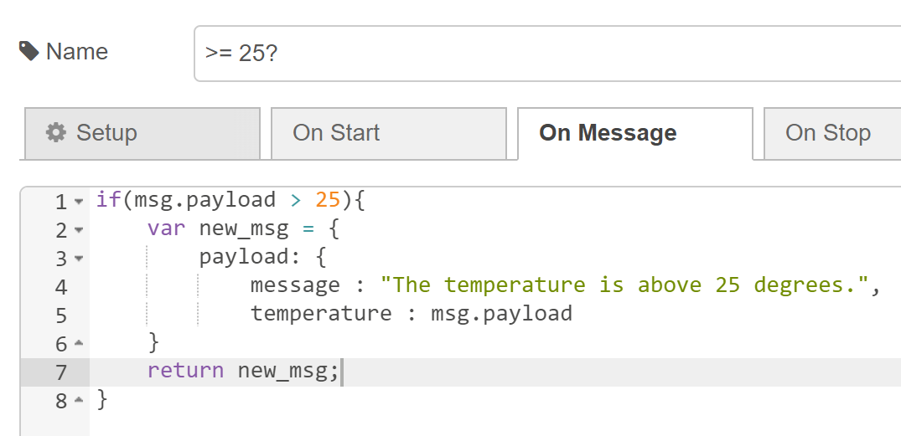

# Node-RED Alerts

## Objective

Our goal in this lab is to make real-time email and Webex alerts when a data parameter we are monitoring exceeds a certain level. This help us so that we don't have to monitor the dashboard all of the time.

## Getting Started

These instructions will take you through setting up a Node-RED flow for alerts.

__You will need:__
* Node.js
* Node-RED
* Webex
* An email

## Node-RED Set Up

### Installation

1. [Install](https://nodejs.org/en/download/) the latest LTS version of Node.js
    1. To verify whether this was installed properly run ```node -v``` and ```npm -v``` (the system should display what node and npm version is installed on your system)
2. [Install](https://nodered.org/docs/getting-started/local) Node-RED locally with npm

### Check

1. Check whether you installed it correctly by running ```node-red``` in your terminal
2. Navigate to http://localhost:1880/ which should automatically direct you to your flow (unless you changed the port number in configuration)

## Webex Bot Set Up

### Installation

[Install](https://www.webex.com/downloads.html) Webex for your operating system

### Developing

1. Sign up for a developer account [here](https://developer.webex.com/)
2. Create a bot [here](https://developer.webex.com/my-apps/new) and fill out the fields
3. Write down your bot's access token
4. Open Webex and add your bot to your alerts space using its username
5. Get the room ID for that space by [here](https://developer.webex.com/docs/api/v1/rooms/list-rooms) and pressing run.
    1. The title should correspond with the name of your alerts space.


## Create Node-RED Flow

1. Navigate to http://localhost:1880/ (or you ```[host]:1880``` if you are not using Node-RED locally)
2. Make a flow in Node-RED that looks like the example below
    1. If you already have a data source, you can use that. For the sake of this tutorial, I will be using inject nodes.
    2. If you need an example of the function node, I provided one here. Please feel free to adjust the msg.payload as necessary for your use case.


3. Make a second flow in Node-RED that looks like the example below

4. Configure the function node like the one below. Remember to replace the placeholders with your room ID and bot's access token.

5. Configure the http request node like the following


## Testing

Every thing should be set up so if you press the inject nodes, if the inject node's value is greater than or equal to 25, your Webex bot should send you a message.

## Conclusion

In this tutorial, you learned how to set up Webex and email alerts to monitor your data.